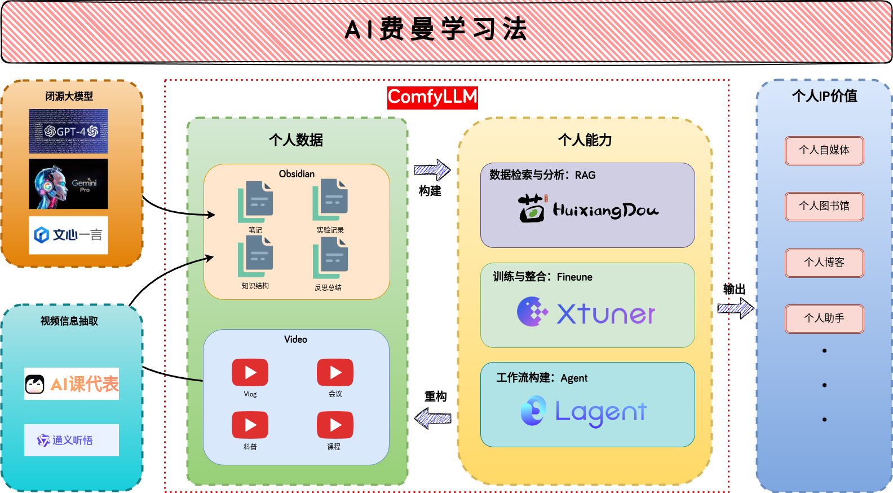
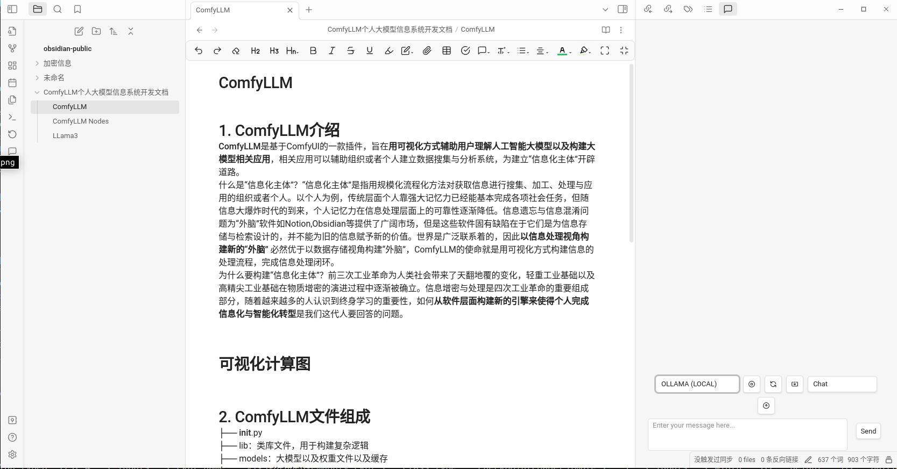
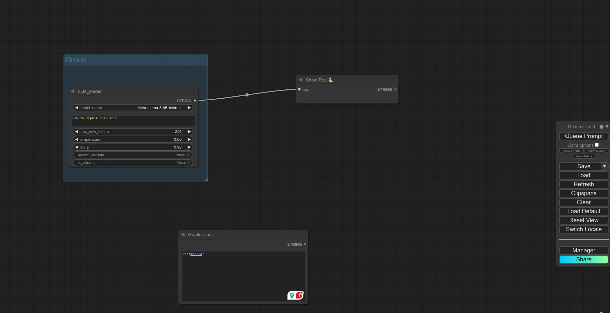
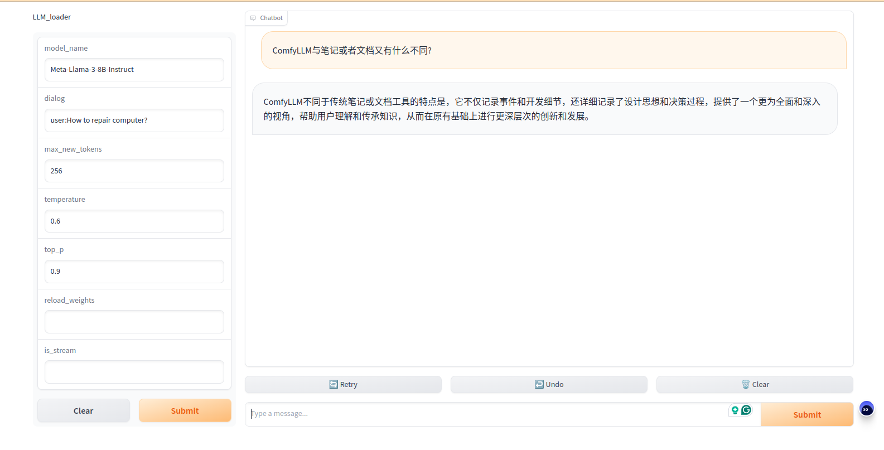

English | 简体中文

## AI 费曼学习法

>将知识讲给他人听，让他人听懂并最终达到知识的融会贯通，这是费曼学习法；将知识讲给机器听，让人和机器都能听懂，这就是AI费曼学习法。AI费曼学习法不仅关注人对知识的理解与运用，还关注机器对同一知识的理解与运用。人和机器对知识的记忆竞争毫无意义，人和机器的协同知识运用才是人工智能的最终目标。

本项目基于**ComfyLLM**,是一款可视化的知识管理、分析与应用框架。框架主要分为三个部分：
1. 笔记数据库：Obsiaian
2. 人工智能分析后台：ComfyLLM
3. 可视化前端：Gradio

以低代码、易部署以及互利共建为核心，包含大模型管理、RAG、LoRA以及其他笔记数据分析等工具，可以对自己的知识与知识体系进行量化评估，用自己的数据训练自己的大模型为自己所用。

代码和人至少有一个能跑，人工和智能至少有一个能动。从纸质笔记，到数字笔记再到到智能笔记最终使得个人成长以及个人能力获取从数字化走向智能化。

### 1.笔记数据库Obsidian

笔记是最早的数据库，成册的笔记进化为了书籍，记录了人类文明的变迁。以Obsidian 笔记构建数据库，根据自己的约定进行信息结构建设，由于Obsidian 笔记为markdown格式，可以自由定制自己的笔记结构，以方便后续的检索。同时按早自己的约定进行数据拆分与组合可以让人工智能更加具有个人独特性。

Obsidian 内置有Api 接口，可以在侧边栏与笔记进行RAG对话交互。也可以用ComfyUI 后端进行更复杂的笔记分析，最终显示在Gradio前端界面。

### 2.人工智能分析后台ComfyUI

ComfyUI 是人工智能的后台，运用数据分析手段来搜集知识体系漏洞以及进行知识体系拓展。实践是真理的源泉，通过开源的工具分析自己的经验以及笔记，最终目标是寻找真正用得上的知识。我们生活在一个信息爆炸的时代，构建工具、使用工具并最终超越工具达到人的全面发展是我们的目标。
后端训练模型基于

### 3.可视化前端Gradio

工具是为了让我们更好的生活，验证成功的工作流可以通过框选直接自动生成对应的前端界面。基于ComfyUI生态不止有文字的输出还有图片、音频、视频等。通过前后端联动，可以直接在Windows云平台构建自己的博客、自己的问答助手等，进一步上升到Agent形成自己独特工作流程辅助自己的日常工作，以我为主服务社会，最终提达到升个人能力与品牌竞争力的目的。

## 支持功能

- Obsidian交互连接
- 框选生成Gradio后端
- RAG

## TODO
- [ ] 向量数据库分析工具
- [ ] Agent
- [ ] LVM
